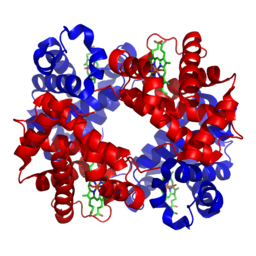
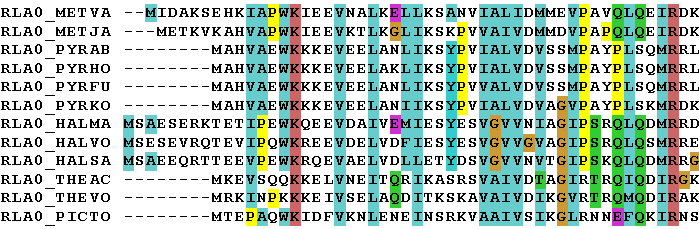

# Understanding Alphafold
There are two key papers that outline the details of Alphafold: Alphafold 2 ([paper](https://www.nature.com/articles/s41586-021-03819-2)/[supplementary information](https://static-content.springer.com/esm/art%3A10.1038%2Fs41586-021-03819-2/MediaObjects/41586_2021_3819_MOESM1_ESM.pdf)) and Alphafold 3 ([paper](https://www.nature.com/articles/s41586-024-07487-w)/[supplementary information](https://static-content.springer.com/esm/art%3A10.1038%2Fs41586-024-07487-w/MediaObjects/41586_2024_7487_MOESM1_ESM.pdf)). This document provides a high level explanation about Alphafold and its motivations.

## Motivations
The primary objective of Alphafold 2 is to predict the structure of a protein given its residue sequence, i.e. the sequence of amino acids. The structure of a protein largely determines its function - for instance, the protein haemoglobin is shaped in a specific way to bind to oxygen. A person affected with sickle cell anaemia produces haemoglobin with a single mutated amino acid that distorts the shape of this protein, subsequently reducing its ability to bind to oxygen and resulting in chronic health issues.

*3D structure of haemoglobin*

Understanding the structure of proteins has wide reaching impact in fields ranging from drug discovery to the creation of [plastic eating enzymes](https://deepmind.google/discover/blog/creating-plastic-eating-enzymes-that-could-save-us-from-pollution/). This problem has historically been very difficult - experimentally finding the structure of a protein is time intensive and expensive. The success of Alphafold is not only due to advancements in machine learning techniques, but also initiatives such as the [Protein Data Bank](https://www.rcsb.org/), a high quality dataset of 220,000 experimentally determined 3D protein structures.

## Biological Interpretation
Let's say we wanted to predict the structure of the [human haemoglobin](https://www.rcsb.org/structure/1a3n) protein mentioned above (ignoring the fact that it is already experimentally resolved). It is significantly cheaper and easier to sequence a protein, i.e. find the sequence of amino acids that make up this protein. This residue sequence is fed into Alphafold which, after a moment of computation, spits out atomic 3D co-ordinates.

Under the hood, Alphafold just performed a few steps. It took this input and searched various genetic databases for the sequences of similar proteins. These sequences were stacked and aligned to make up the "multiple sequence alignment" (MSA). In our haemoglobin example, [donkey haemoglobin](https://www.rcsb.org/sequence/1S0H) contains similar amino acids and would therefore be included in the MSA.

*An example multiple sequence alignment*

The MSA indirectly contains a lot of information about haemoglobin's structure. For example, it contains evolutionarily related proteins that perform a similar function - e.g. haemoglobins from various animals that all handle the transportation of oxygen around the blood. As mentioned before, the function of a protein is closely related to its structure, so it is highly likely that these haemoglobins have similar shapes. When this logic is applied across thousands of similar proteins, we can start picking out patterns contained in the MSA. Certain positions along the sequences seem to mutate together even though they are far apart in the input sequence. This would indicate that they are close together in 3D space - when one mutates, the other must also mutate in tandem so as not to disrupt the structure.

Alphafold also searches for "templates", experimentally resolved proteins that are similar to the input. The quality of templates can vary depending on the input protein, so Alphafold is trained in a way to not be too reliant on the structural information provided here.

## Model Architecture
### Alphafold 2
Alphafold 2 consists of two major components - the Evoformer and the Structure Module. The Evoformer extracts information from the MSA using [attention mechanisms](https://en.wikipedia.org/wiki/Attention_(machine_learning)) into an "MSA representation", which is used to update a "pair representation". This pair representation represents the edges of a graph, where each node is a different residue. Each edge contains information about the distance between two residues, i.e. the pair representation contains the first abstract representation of the protein which is later refined into co-ordinates by the Structure Module. The Evoformer further processes the pair representation to allow edges forming a triangle to communicate with each other. This builds in restrictions due to the triangle inequality - for instance, if we take the triangle ABC where BA and BC are both 1nm long, we now know AC can at most be 2nm. The Structure Module is then responsible for refining the Evoformer representations down into predicted co-ordinates, again using various attention mechanisms.

Alphafold 2 defines a number of losses that aims to train different parts of the model. The main loss is the "frame aligned point error", comparing the predicted and ground truth atomic co-ordinates. The model also predicts a distogram from the pair representation to compute the "distogram loss", ensuring the pair representation does indeed learn structural properties of the protein. The final key loss is the MSA loss - Alphafold masks the input MSA and attempts to predict the masked residues, ensuring Alphafold can learn relationships in the MSA sequences.

### Alphafold 3
Alphafold 3 replaces the two major components of Alphafold 2 with the Pairformer and Diffusion Module. The Pairformer is a simpler (and more efficient) version of the Evoformer, which no longer directly processes the MSA representation. The Diffusion Module now uses diffusion techniques to predict the co-ordinates. It starts with a point cloud of random noise, before iteratively refining the co-ordinates based on the information extracted by the Pairformer.

The losses used in Alphafold 3 are also simplified in comparison to Alphafold 2. The primary loss is the diffusion loss, once again operating on the final atomic co-ordinates. The distogram loss remains from Alphafold 2 - however it is scaled to a much smaller proportion of the total loss hence allowing the diffusion loss to dominate training.
